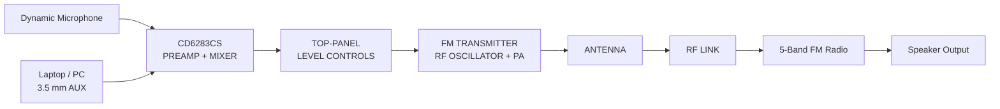
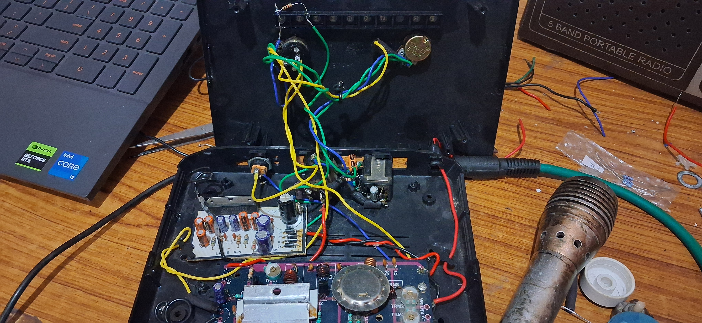
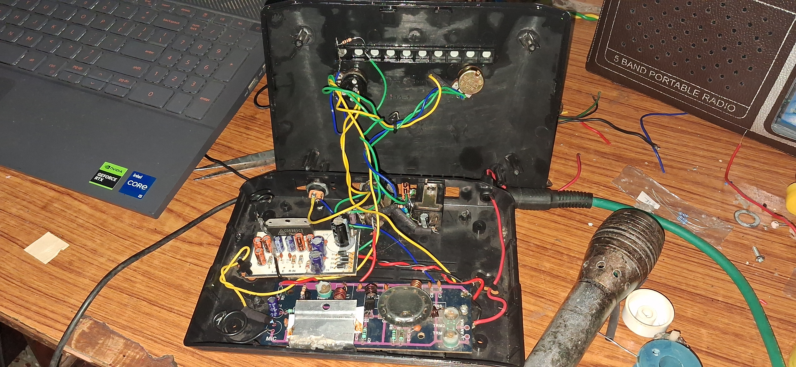
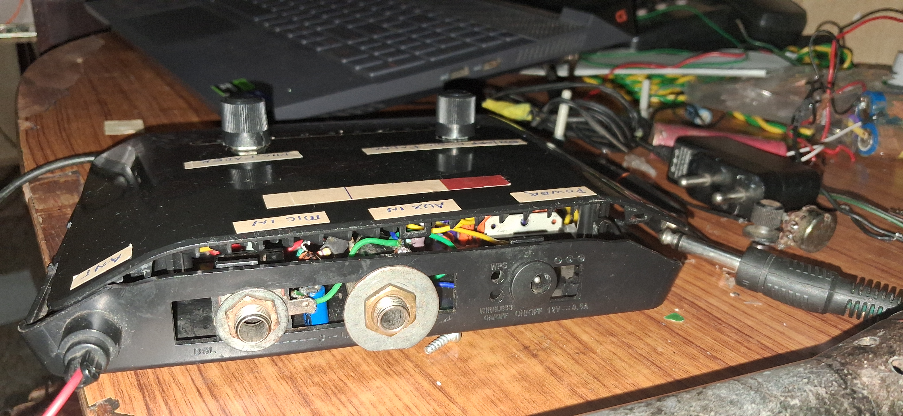

# 📡 RouterMod FM

### *An analog RF broadcast system engineered inside the chassis of a dead Wi-Fi router*

---

> Somewhere between a teardown, a signal-chain design exercise, and an act of electronic necromancy — **RouterMod FM** takes a piece of e-waste and turns it into a functional, dual-input analog FM broadcast system. No microcontrollers. No DSP. No digital-to-analog conversion in the signal chain. Just analog audio, RF circuitry, transistors, inductors, and a lot of hands-on debugging.

---

## 🧪 Abstract

Consumer Wi-Fi routers are, mechanically speaking, compact RF-oriented enclosures with ventilation, convenient power entry, and multiple pre-existing I/O cutouts. This project exploits those mechanical features: the dead internals of a router are removed entirely and replaced with a custom **analog audio mixing stage** cascaded into an **FM transmitter stage**, while the original chassis, antenna mounts, top-shell controls, and rear I/O cutouts are repurposed for the new system.

The result is a self-contained broadcast unit that accepts two simultaneous audio sources — a line-level laptop feed and a live dynamic microphone — conditions and mixes them in the analog domain, feeds the resulting audio into an FM transmitter, and transmits the resulting RF signal to a nearby FM receiver.

---

## 🔬 System Architecture

### Signal Flow

**Audio:** `Microphone + AUX → Preamp/Mixer → Level Controls`

**RF:** `FM Oscillator → RF Power Amplifier → Antenna`

**Reception:** `Antenna → FM Receiver → FM Demodulation → Speaker`

---

## ⚙️ Signal Chain — Stage by Stage

### 1. Dual Signal Acquisition

Two physically and electrically different audio sources are captured simultaneously through dedicated jacks mounted into the router's rear panel:

* **Line-level audio** from a laptop through the 3.5 mm AUX IN jack
* **Dynamic microphone** input through the dedicated MIC IN jack

The two sources have substantially different signal levels and source characteristics, making proper gain staging important before mixing.

### 2. Preamplification & Mixing

The microphone and line-level signals are fed into a dedicated preamp/mixer board built around a **CD6283CS** audio amplifier IC.

The board contains coupling capacitors, filtering components, and associated biasing circuitry. The PCB is marked with **`L-IN`**, **`E`**, and **`R-IN`** input markings.

The stage conditions and combines the two audio sources so that microphone input can be mixed with the background audio without excessive clipping or attenuation.

### 3. Passive Level Control

The mixed audio signal is routed through two potentiometers mounted through the router's top shell.

These controls are used for:

* Microphone level adjustment
* Master/AUX audio level adjustment

The original physical layout of the router is therefore repurposed as a simple live audio control interface.

### 4. RF Carrier Generation & Frequency Modulation

The conditioned audio signal is applied to the FM transmitter stage, where the audio information modulates the frequency of an RF carrier.

Unlike AM, where information is represented primarily through carrier amplitude variation, FM represents the information through **instantaneous frequency variation** around the carrier frequency.

This makes clean audio gain staging important because unwanted noise and distortion in the audio path can affect the resulting modulation.

### 5. RF Power Amplification & Matching

The RF board contains the oscillator and RF amplification stages along with hand-wound tuning coils and trimmer capacitors marked **`TRM1`** and **`TRM2`**.

The RF power transistor is mechanically coupled to an aluminum heatsink. The amplified RF signal is then coupled toward the antenna output.

The board's antenna connection is marked **`ANTINA`**.

### 6. Radiation & Reception

The RF signal exits through the antenna connection and propagates over the air.

A **5-Band Portable Radio** is used as the receive-side reference. When tuned to the transmitter's operating frequency, the receiver demodulates the FM signal and reproduces the recovered audio through its speaker.

---

## 🧵 Why the Router Chassis?

The router enclosure turned out to be more than just a convenient box.

Several existing mechanical features could be directly reused:

* **Original antenna mounting points** repurposed for the RF output
* **Rear I/O cutouts** reused for MIC IN, AUX IN, POWER, and ANT connections
* **Top-shell button/control area** reused for the potentiometers
* **Ventilated plastic enclosure** providing physical separation and airflow around the electronics
* **Compact enclosure** allowing the complete analog audio and RF system to be integrated into a single unit

This makes the project a practical example of **adaptive hardware reuse** — taking the mechanical constraints of an existing consumer product and adapting them for an entirely different electronic system.

---

## 🔧 Hardware Summary

| Subsystem                    | Function                                                                                           |
| ---------------------------- | -------------------------------------------------------------------------------------------------- |
| **Chassis**                  | Gutted router shell housing the boards, wiring, power routing, and controls                        |
| **Preamp & Mixer Board**     | CD6283CS audio IC with coupling/filtering network for microphone and AUX mixing                    |
| **RF Oscillator / PA Board** | RF oscillator, tuning coils, trimmer capacitors, RF power transistor, heatsink, and antenna output |
| **Top-Shell Controls**       | Two potentiometers for microphone and master/AUX level adjustment                                  |
| **Rear Panel I/O**           | MIC IN, AUX IN, POWER, and ANT connections                                                         |
| **Reference Receiver**       | 5-Band Portable Radio used for tuning and reception verification                                   |

---

## 📷 Build Gallery

|             Internal Wiring & Board Stack            |             Preamp/Mixer + RF Board            |                 Completed Router Enclosure                |
| :--------------------------------------------------: | :--------------------------------------------: | :-------------------------------------------------------: |
|  |  |  |

---

## 🎥 Live Demonstration

A working demonstration shows the complete analog signal chain operating end-to-end.

The demonstration includes:

* Laptop audio entering through **AUX IN**
* Live microphone input through **MIC IN**
* Analog mixing inside the enclosure
* Real-time adjustment of the top-panel controls
* FM transmission through the antenna
* Reception through a portable FM radio
* Recovery of the mixed audio through the receiver speaker

**Demo video:** *To be added*

> The demonstration video will be linked here once uploaded to a suitable video host.

---

## 📈 Key Engineering Properties

* **Negligible-latency analog signal path** — the audio chain contains no digital sampling, codec processing, or software buffering.
* **Real-time dual-source mixing** — microphone and background audio can be combined continuously in the analog domain.
* **Analog audio + discrete RF architecture** — the CD6283CS-based audio stage feeds a transistor-based RF oscillator and amplification stage.
* **Hands-on RF tuning** — the transmitter stage uses physical tuning components including coils and trimmer capacitors.
* **Compact system integration** — audio processing, RF electronics, power routing, controls, and I/O are integrated into a repurposed consumer enclosure.
* **E-waste reuse** — a non-functional router chassis is given a completely different engineering purpose.

---

## ⚠️ Regulatory & Safety Note

RF transmission is regulated and the permitted power, frequency usage, bandwidth, and operating conditions vary by jurisdiction.

This project is intended as a **short-range educational and hobbyist RF experiment**. Actual operation should comply with local spectrum regulations and applicable low-power transmission limits.

The transmitter should be operated responsibly and should not interfere with licensed radio services or other users of the radio spectrum.

---

## 🧭 Future Work

* [ ] Add RF shielding around the PA stage to reduce unwanted coupling and interference
* [ ] Characterize the transmitter frequency and stability using appropriate RF test equipment
* [ ] Replace manual tuning with a varactor-based frequency-control system
* [ ] Add a digital frequency readout
* [ ] Add a low-pass/harmonic filtering stage after the RF power amplifier
* [ ] Characterize RF output power and antenna performance
* [ ] Develop a cleaner PCB-based version of the point-to-point wiring
* [ ] Build a battery-powered portable variant
* [ ] Improve the internal wiring harness and mechanical mounting

---

## 📚 Skills Demonstrated

**RF Engineering**

* FM modulation
* RF oscillator operation
* RF power amplification
* RF tuning
* Antenna interfacing
* Wireless signal transmission and reception

**Analog Electronics**

* Audio preamplification
* Analog signal mixing
* Coupling and filtering
* Gain staging
* Potentiometer-based level control

**Hardware Engineering**

* Point-to-point wiring
* Hardware debugging
* Mechanical enclosure modification
* Power routing
* System integration
* E-waste repurposing

---

## 📄 License

This project is provided for educational and hobbyist purposes.

---

<i>Built from a dead router, some analog circuitry, and an unreasonable amount of curiosity.</i>

